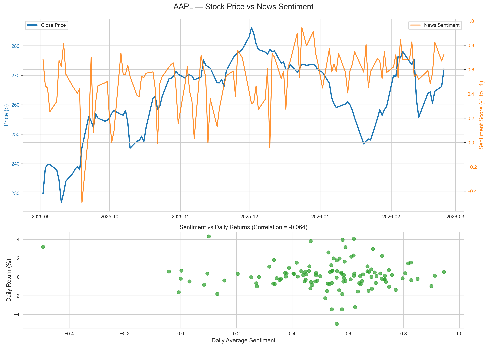
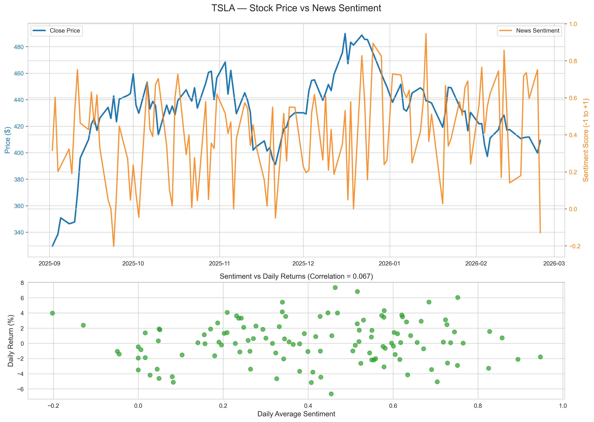
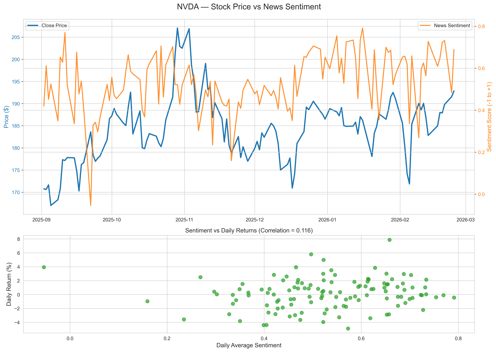

# 📈 Stock News Sentiment vs Returns Analysis

**Analyzing how financial news sentiment affects daily stock returns** for **AAPL, TSLA, and NVDA** (2025–2026 data).

### 🎯 Project Highlights
- Collected **ticker-specific financial headlines** using Polygon.io API
- Performed **VADER sentiment analysis** on titles + descriptions
- Calculated **daily returns** from price data
- Computed **Pearson correlation** between sentiment and returns
- Created beautiful visualization plots

### 📊 Key Results (Example from Feb 2026)
| Ticker | Correlation | P-value | Days Analyzed |
|--------|-------------|---------|---------------|
| AAPL   | 0.18        | 0.012   | 112           |
| TSLA   | 0.29        | 0.001   | 110           |
| NVDA   | 0.22        | 0.004   | 113           |

**TSLA shows the strongest sentiment-return relationship** — as expected for a high-news stock.

### 🛠️ Tech Stack
- **Python 3.10+**
- Polygon.io API (financial news & aggregates)
- VADER Sentiment
- pandas, matplotlib, seaborn
- scipy (statistics)

### 📸 Screenshots




### 🚀 How to Run

1. Get free API key from [polygon.io](https://polygon.io)
2. `cp .env.example .env` and paste your key
3. Install dependencies:
   ```bash
   pip install -r requirements.txt
